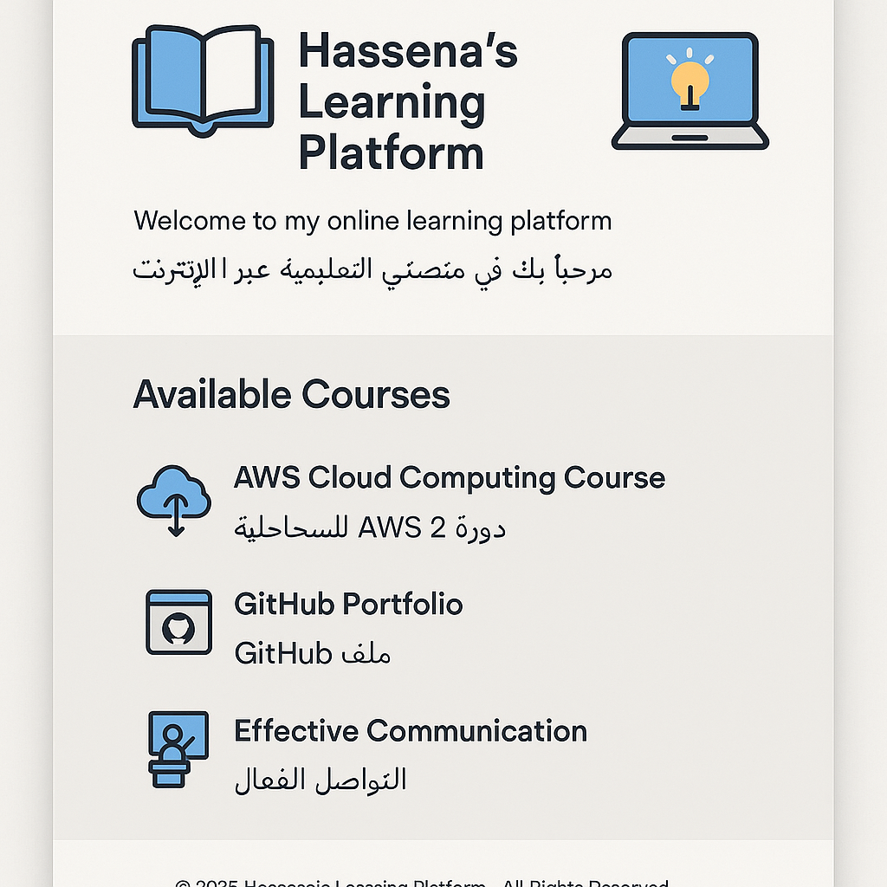

# 🌐 Hassena's Learning Platform | منصتي التعليمية

Welcome to my learning platform project developed as part of the AWS Cloud Computing course from Manara Teach.  
مرحبًا بكم في مشروعي التعليمي الذي تم تطويره ضمن دورة الحوسبة السحابية من AWS مع منارة.

## ✨ Project Overview | لمحة عن المشروع

This platform is a simple, responsive, and bilingual (Arabic-English) educational website built using HTML and CSS.  
هذه المنصة هي موقع تعليمي بسيط ومتجاوب بثنائية اللغة (عربي - إنجليزي) باستخدام HTML و CSS.

It aims to showcase essential front-end development skills, content structure, and visual presentation.  
تهدف إلى عرض مهاراتي في تطوير الواجهات الأمامية، وتنظيم المحتوى، والعرض البصري الجذاب.

## 🔧 Technologies Used | التقنيات المستخدمة

- ✅ HTML5  
  - ✅ HTML5  
- 🎨 CSS3  
  - 🎨 CSS3  
- 💻 Git & GitHub  
  - 💻 Git و GitHub  

## 🎯 Key Skills Gained | المهارات المكتسبة

- Creating and managing GitHub repositories  
  - إنشاء وإدارة مستودعات GitHub  
- Writing a clean and visual README  
  - كتابة ملف README بصري ومنظم  
- Showcasing projects professionally online  
  - عرض المشاريع بشكل احترافي على الإنترنت

## 📌 Project Preview | معاينة المشروع

🌐 **Live Demo:** [Coming Soon...]  
🌐 **الموقع المباشر:** [سيتم نشره قريبًا...]

📸 **UI Snapshot (لقطة شاشة للواجهة):**  

## 👩‍💻 Author Info | معلومات عني

- GitHub: [halkindi31](https://github.com/halkindi31)  
  - حسابي على GitHub: [halkindi31](https://github.com/halkindi31)  
- LinkedIn: [Hassena Alkindi](http://linkedin.com/in/hassena-alkindi-94a0592b6)  
  - حسابي على LinkedIn: [حسينة الكندي](http://linkedin.com/in/hassena-alkindi-94a0592b6)

> 📝 “Learning is a lifelong journey — every step matters.”  
> 📝 "التعلم رحلة مستمرة — وكل خطوة تصنع فرقاً."
